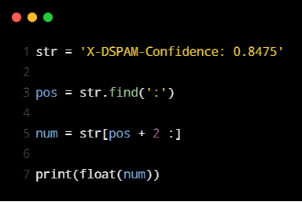
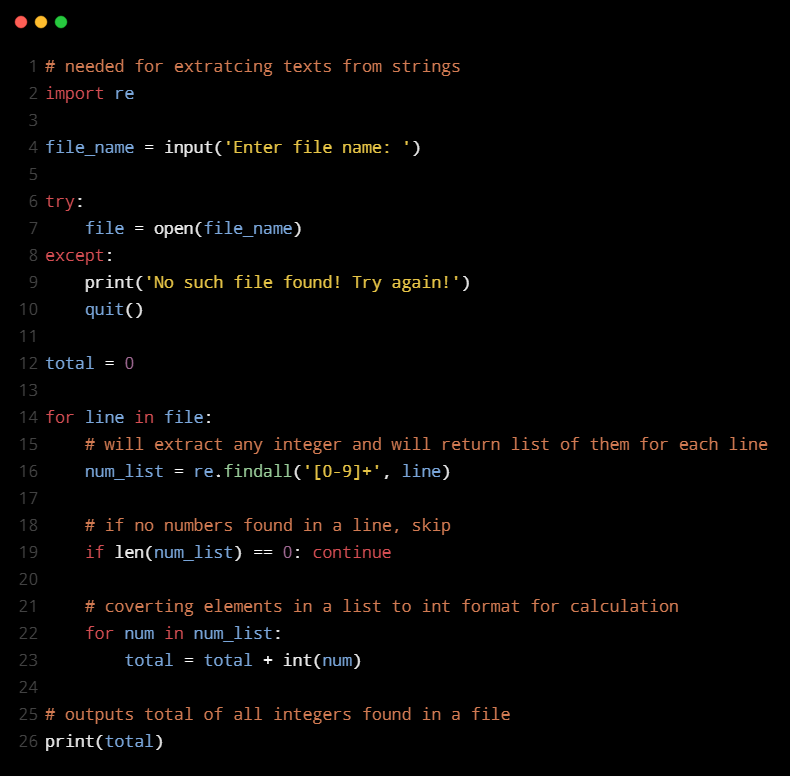

# Guide on how to code in Python.
*For beginners on the road to expert!*

## Table of Contents

- [Hello World](#1-hello-world)
- [Hello User](#2-hello-user)
- [Compute Gross Pay](#3-compute-gross-pay)
- [Compute Gross Pay with Conditions](#4-gross-pay-with-conditions)
- [Try Except](#try-except)
  - [Gross Pay](#5-gross-pay)
  - [Grading System](#6-grading-system)
- [Functions](#functions)
  - [Gross Pay](#7-gross-pay)
  - [Grading System](#8-grading-system)
- [Loop](#loop)
  - [Compute Input](#9-compute-input)
  - [Min & Max](#10-min-and-max)
- [Strings](#11-string)
- [File](#file)
  - [Print text from a file](#12-print-text-from-file)
  - [Compute values within file](#13-compute-values-within-file)
- [List](#list)
  - [Splitting and Sorting](#14-splitting-and-sorting)
  - [Email Count](#15-email-count)
- [Dictionary](#16-dictionary)
- [Tuples](#17-tuples)
- [Expressions](#expressions)
  - [Compute values within file](#18-compute-values-within-file)
  - [Highest Emails](#19-highest-emails)
  - [Finding Number](#20-finding-number)

----

###  1. Hello World
**Q.  Output *'Hello World'* to the screen.**
<br>

*[Code](https://github.com/JuzerShakir/How-to-Python/blob/master/Hello%20World.py)*

<p></p>


<br>

**Output.**

```
Hello World
```

---

###  2. Hello User
**Q. Greet *'Hello'* to the user with *it's name.***
<br>

*[Code](https://github.com/JuzerShakir/How-to-Python/blob/master/Hello%20User.py)*

<p></p>

<br>

**Input:**

```
Juzer Shakir
```

**Output:**

```
Hello Juzer Shakir
```

*[Back to Top](#table-of-contents)*

---

### 3. Compute Gross Pay
**Q. Write a program to prompt user for hours and rate per hour to compute their gross pay.**
<br>

*[Code](https://github.com/JuzerShakir/How-to-Python/blob/master/Compute%20Gross%20Pay.py)*

<p></p>

<br>

**Input:**

```
Enter Hours: 10
Enter Rate: 10
```
**Output:**

```
Pay: 1000.0
```

---

### 4. Gross Pay with Conditions
**Q. Rewrite your pay computation *([Exercise 3](#3-compute-gross-pay))* to give the employee 1.5 times the hourly rate for hours worked above 40 hours.**
<br>

*[Code](https://github.com/JuzerShakir/How-to-Python/blob/master/Compute%20Gross%20Pay%20with%20Conditions.py)*

<p></p>

<br>

**Scenario 1:**
<br>

<h6>Input</h6>

```
Enter Hours: 10
Enter Rate: 10
```

<h6>Output:</h6>

```
Pay: 1000.0
```
**Scenario 2:**
<br>

<h6>Input</h6>

```
Enter Hours: 45
Enter Rate: 10
```

<h6>Output:</h6>

```
Pay: 475.0
```


*[Back to Top](#table-of-contents)*

---

### Try Except
#### 5. Gross Pay
**Q. Rewrite your pay program *([Exercise 4](#4-gross-pay-with-conditions))* using try and except so that your program handles non-numeric input gracefully by printing a message and exiting the program.**
<br>

*[Code](https://github.com/JuzerShakir/How-to-Python/blob/master/Try%20Except/Gross%20Pay.py)*

<p></p>

<br>

**Scenario 1:**
<br>

<h6>Input</h6>

```
Enter Hours: five
```

<h6>Output:</h6>

```
Error, please enter numeric input
```
**Scenario 2:**
<br>

<h6>Input</h6>

```
Enter Hours: 65
Enter Rate: 8
```

<h6>Output:</h6>

```
Pay: 620.0
```

---

#### 6. Grading System
**Q. Write a program to prompt for a score between 0.0 and 1.0. If the score is out of range, print an error message.<br>
If the score is between 0.0 and 1.0, print a grade using the following table:**

| **Score** |  **Grade** |
| --------- | ---------- |
| **>=0.9** |  A         |
| **>=0.8** |  B         |
| **>=0.7** |  C         |
| **>=0.6** |  D         |
| **< 0.6** |  F         |

<br>

*[Code](https://github.com/JuzerShakir/How-to-Python/blob/master/Try%20Except/Grading%20System.py)*

<p></p>

<br>

**Scenario 1:**
<br>

<h6>Input</h6>

```
Enter score: 1.1
```

<h6>Output:</h6>

```
Bad Score
```
**Scenario 2:**
<br>

<h6>Input</h6>

```
Enter score: 0.76
```

<h6>Output:</h6>

```
C
```

*[Back to Top](#table-of-contents)*

---

### Functions
#### 7. Gross Pay
**Q. Rewrite your pay computation *([Exercise 5](#5-gross-pay))* and create a function called *'computepay'* which takes two parameters (hours and rate).**
<br>

*[Code](https://github.com/JuzerShakir/How-to-Python/blob/master/Functions/Gross%20Pay.py)*

<p></p>

<br>

**Scenario 1:**
<br>

<h6>Input</h6>

```
Enter Hours: 60
Enter Rate: eleven
```

<h6>Output:</h6>

```
Error, please enter numeric input
```
**Scenario 2:**
<br>

<h6>Input</h6>

```
Enter Hours: 40.5
Enter Rate: 9.5
```

<h6>Output:</h6>

```
Pay: 387.125
```

---

#### 8. Grading System
**Q. Rewrite grading program *([Exercise 6](#6-grading-system))* using function named *'computegrade'*.**
<br>

*[Code](https://github.com/JuzerShakir/How-to-Python/blob/master/Functions/Grading%20System.py)*

<p></p>

<br>

**Scenario 1:**
<br>

<h6>Input</h6>

```
Enter score: 0.52
```

<h6>Output:</h6>

```
F
```
**Scenario 2:**
<br>

<h6>Input</h6>

```
Enter score: 0.83
```

<h6>Output:</h6>

```
B
```

*[Back to Top](#table-of-contents)*

---

### Loop
#### 9. Compute Input
**Q. Write a program which repeatedly reads numbers until the user inputs *"done"*. Once *"done"* is entered, print out the *total, count, and average* of the *input numbers*. If the user enters anything other than a number,  detect their mistake using try and except and print an error message and skip to the next number.**
<br>

*[Code](https://github.com/JuzerShakir/How-to-Python/blob/master/Loop/Compute%20Input.py)*

<p></p>

<br>

**Scenario 1:**

###### Input:
```
Enter a number: juzer
Invalid input
Enter a number: one
Invalid input
Enter a number: twenty
Invalid input
Enter a number: done
```

###### Output:
```
Canonot compute string input. Only numeric input allowed.
```

**Scenario 2:**

###### Input:
```
Enter a number: 97
Enter a number: 176
Enter a number: 32
Enter a number: forty 
Invalid input
Enter a number: 40
Enter a number: 64
Enter a number: 21
Enter a number: 99
Enter a number: 58
Enter a number: hundred
Invalid input
Enter a number: 100
Enter a number: done
```

###### Output:
```
Total of all 9 numeric inputs are 687.0 with an average of 76.33333333333333
```

**Scenario 3:**

###### Input:
```
Enter a number: 97
Enter a number: 11
Enter a number: 41
Enter a number: 86
Enter a number: 191
Enter a number: 80
Enter a number: 23
Enter a number: 153
Enter a number: done
```

###### Output:
```
Total of all 8 numeric inputs are 682.0 with an average of 85.25
```

---

#### 10. Min and Max
**Q. Similar to *[Exercise 9](#9-compute-input)*, only output a minimum and a maximum number inputted by the user.**
<br>

*[Code](https://github.com/JuzerShakir/How-to-Python/blob/master/Loop/Min%20and%20Max.py)*

<p></p>

<br>

**Scenario 1:**

###### Input:
```
Enter a number: ww
Invald input.
Enter a number: nine
Invald input.
Enter a number: done
```

###### Output:
```
Minimum = None Maximum = None
```

**Scenario 2:**

###### Input:
```
Enter a number: 70
Enter a number: 80
Enter a number: 37
Enter a number: 49
Enter a number: lalala 
Invald input.
Enter a number: 56
Enter a number: 1
Enter a number: 6
Enter a number: don 
Invald input.
Enter a number: done
```

###### Output:
```
Minimum = 1.0 Maximum = 80.0
```

**Scenario 3:**

###### Input:
```
Enter a number: 17
Enter a number: 30
Enter a number: 61
Enter a number: 102
Enter a number: 5
Enter a number: 110
Enter a number: 45
Enter a number: 69
Enter a number: 87
Enter a number: done
```

###### Output:
```
Minimum = 5.0 Maximum = 110.0
```

*[Back to Top](#table-of-contents)*

---

### 11. String
**Q. Use *'find'* and *string slicing* to extract the portion of the string after the colon character and then use the float function to convert the extracted string into a floating point number.**<br>
*str = 'X-DSPAM-Confidence: 0.8475'*
    
<br>

*[Code](https://github.com/JuzerShakir/How-to-Python/blob/master/String.py)*

<p></p>

<br>

**Output.**

```
0.8475
```

---

### File
#### 12. Print text from file
**Q. Write a program to read through a file *[mbox-short.txt](https://github.com/JuzerShakir/How-to-Python/blob/master/File/mbox-short.txt)* and print the contents of the file (line by line) all in upper case.**
<br>

*[Code](https://github.com/JuzerShakir/How-to-Python/blob/master/File/Print%20text%20from%20a%20file.py)*

<p></p>

<br>

**Scenario 1:**

###### Input:
```
Enter a file name: short.txt
```

###### Output:
```
No such file exists in this directory with this file name: short.txt
```

**Scenario 2:**

###### Input:
```
Enter a file name: mbox-short.txt
```

###### Output:
```
FROM STEPHEN.MARQUARD@UCT.AC.ZA SAT JAN  5 09:14:16 2008

RETURN-PATH: <POSTMASTER@COLLAB.SAKAIPROJECT.ORG>

RECEIVED: FROM MURDER (MAIL.UMICH.EDU [141.211.14.90])

         BY FRANKENSTEIN.MAIL.UMICH.EDU (CYRUS V2.3.8) WITH LMTPA;

         SAT, 05 JAN 2008 09:14:16 -0500

X-SIEVE: CMU SIEVE 2.3

RECEIVED: FROM MURDER ([UNIX SOCKET])

         BY MAIL.UMICH.EDU (CYRUS V2.2.12) WITH LMTPA;

         SAT, 05 JAN 2008 09:14:16 -0500
```

*[Back to Top](#table-of-contents)*

---

#### 13. Compute values within file
**Q. Write a program to read through the file *[mbox-long.txt](https://github.com/JuzerShakir/How-to-Python/blob/master/File/mbox-long.txt)* and look for lines of the form:**<br>

*X-DSPAM-Confidence: 0.8475* <br>

**When you encounter a line that starts with *"X-DSPAM-Confidence:"* pull apart the line to extract the floating-point number from that line. Count number of occurances on the file and then compute the total of the spam confidence values from these lines. Also print out the average spam confidence values.**

<br>

*[Code](https://github.com/JuzerShakir/How-to-Python/blob/master/File/Compute%20values%20within%20file.py)*

<p></p>

<br>

**Scenario 1:**

###### Input:
```
Enter a file name: short.txt
```

###### Output:
```
No such file exists in this directory with this file name: short.txt
```

**Scenario 2:**

###### Input:
```
Enter a file name: mbox-short.txt
```

###### Output:
```
This file does not contain spam confidence values to compute. Please input file name of appropriate file.
```

**Scenario 3:**

###### Input:
```
Enter a file name: mbox-long.txt
```

###### Output:
```
Average spam confidence: 0.7507185185185187
```

---

### List
#### 14. Splitting and Sorting
**Q.  Write a program to open the file *[romeo.txt](https://github.com/JuzerShakir/How-to-Python/blob/master/List/romeo.txt)* and read it line by line.**<br>
**For each line, split the line into a list of words using the *'split'* function. For each word, check to see if the word is already in a list. If the word is not in the list, add it to the list. When the program completes, sort and print the resulting words in alphabetical order.**
<br>

*[Code](https://github.com/JuzerShakir/How-to-Python/blob/master/List/Splitting%20and%20Sorting.py)*

<p></p>

<br>

**Scenario 1:**

###### Input:
```
Enter a file name: domeo.txt
```

###### Output:
```
domeo.txt doesnt exist!
```

**Scenario 2:**

###### Input:
```
Enter a file name: romeo.txt
```

###### Output:
```
['Arise', 'But', 'It', 'Juliet', 'Who', 'already', 'and', 'breaks', 'east', 'envious', 'fair', 'grief', 'is', 'kill', 'light', 'moon', 'pale', 'sick', 'soft', 'sun', 'the', 'through', 'what', 'window', 'with', 'yonder']
```

*[Back to Top](#table-of-contents)*

---

#### 15. Email Count
**Q. Write a program to read through a mail log from *[mbox-long.txt](https://github.com/JuzerShakir/How-to-Python/blob/master/List/mbox-long.txt)*  file, line starting with *'From '*. You will parse the From line using split() and print out the second word in the line (i.e. the entire address of the person who sent the message). Then print out a count at the end.**

*Hint: make sure not to include the lines that start with 'From:'.*

<br>

*[Code](https://github.com/JuzerShakir/How-to-Python/blob/master/List/Email%20Count.py)*

<p></p>

<br>

**Scenario 1:**

###### Input:
```
Enter a file name: domeo.txt
```

###### Output:
```
domeo.txt file doesnt exist!
```

**Scenario 2:**

###### Input:
```
Enter a file name: romeo.txt
```

###### Output:
```
Please input desired file name for computation.
```

**Scenario 3:**

###### Input:
```
Enter a file name: mbox-long.txt
```

###### Output:
```
stephen.marquard@uct.ac.za
louis@media.berkeley.edu
zqian@umich.edu
rjlowe@iupui.edu
zqian@umich.edu
rjlowe@iupui.edu
cwen@iupui.edu
cwen@iupui.edu
gsilver@umich.edu
gsilver@umich.edu
zqian@umich.edu
gsilver@umich.edu
wagnermr@iupui.edu
zqian@umich.edu
antranig@caret.cam.ac.uk
gopal.ramasammycook@gmail.com
david.horwitz@uct.ac.za
david.horwitz@uct.ac.za
david.horwitz@uct.ac.za
david.horwitz@uct.ac.za
stephen.marquard@uct.ac.za
louis@media.berkeley.edu
louis@media.berkeley.edu
ray@media.berkeley.edu
cwen@iupui.edu
cwen@iupui.edu
cwen@iupui.edu
There were 27 lines in the file with 'From' as the first word
```

----

### 16. Dictionary
**Q. Write a program to read through a mail log from *[mbox-long.txt](https://github.com/JuzerShakir/How-to-Python/blob/master/Dictionary/mbox-long.txt)*  file, line starting with *'From '*. Build a histogram using a dictionary to count how many messages have come from each email address.** <br>

**Look through the dictionary using loop to find who has the most messages and print how many messages the person has.**

*Note: make sure not to include the lines that start with 'From:'.*

<br>

*[Code](https://github.com/JuzerShakir/How-to-Python/blob/master/Dictionary/Most_email.py)*

<p></p>

<br>

**Scenario 1:**

###### Input:
```
Enter file name: mbox.txt
```

###### Output:
```
mbox.txt file doesn't exist
```

**Scenario 2:**

###### Input:
```
Enter file name: mbox-long.txt
```

###### Output:
```
cwen@iupui.edu has most messages of 5
```

---

### 17. Tuples
**Q. Write a program that counts the distribution of the hour of the day for each of the messages in the *[mbox-long.txt](https://github.com/JuzerShakir/How-to-Python/blob/master/Tuples/mbox-long.txt)* file. You can pull the hour from the *'From '* line by finding the time string and then splitting that string into parts using the colon character.**<br>
**Once you have accumulated the counts for each hour, print out the counts, one per line, sorted by hour.**
<br>

*[Code](https://github.com/JuzerShakir/How-to-Python/blob/master/Tuples/Most_mail_hour.py)*

<p></p>

<br>

**Scenario 1:**

###### Input:
```
Enter file name: 11
```

###### Output:
```
11 file doesn't exist
```

**Scenario 2:**

###### Input:
```
Enter file name: mbox-long.txt
```

###### Output:
```
04 3
06 1
07 1
09 2
10 3
11 6
14 1
15 2
16 4
17 2
18 1
19 1
```

*[Back to Top](#table-of-contents)*

---

### Regular Expressions

Regular expressions cheat sheet:

|    Regular Expressions |    Description                           |
| ---------------------- | ---------------------------------------- |
|    ^                   |    Matches the beginning of a line       |
|    $                   |    Matches the end of the line           |
|    .                   |    Matches any character                 |
|    \s                  |    Matches Whitespace                    |
|    \S                  |    Matches any non-whitespace character  |
|     *                  | Repeats a character zero or more times   |
|     *?                 | Repeats a character zero or more times (Non-Greedy) |
|      +                 | Repeats a character one or more times    |
|      +?                | Repeats a character one or more times  (Non-Greedy) |
|  [aeiou]               | Matches a single character in the listed set|
|     [^XYZ]             | Matches a single character not in the listed set|
|     [a-z0-9]           | The set of characters can include a range |
|      (                 | Indicates where string extraction is to start |
|       )                | Indicates where string extraction is to end |


#### 18. Compute values within file
**Q. Sum up all *'X-DSPAM-Confidence'* values from *[mbox.txt](https://github.com/JuzerShakir/How-to-Python/blob/master/Expressions/mbox.txt)* file.**
<br>

*[Code](https://github.com/JuzerShakir/How-to-Python/blob/master/Expressions/Compute%20values%20within%20file.py)*

<p></p>

<br>

**Scenario 1:**

###### Input:
```
Enter file name: dummy
```

###### Output:
```
No such file found! Try again!
```

**Scenario 2:**

###### Input:
```
Enter file name: mbox.txt
```

###### Output:
```
667.8322999999995
```

---

#### 19. Highest Emails
**Q. Write a program similar to *[Exercise 15](#15-dictionary)* but regardless of whether the line starts from *'From'* on *[mbox.txt](https://github.com/JuzerShakir/How-to-Python/blob/master/Expressions/mbox.txt)* file.**
<br>

*[Code](https://github.com/JuzerShakir/How-to-Python/blob/master/Expressions/Highest%20Email.py)*

<p></p>

<br>

**Scenario 1:**

###### Input:
```
Enter file name: dummy
```

###### Output:
```
No such file found! Try again!
```

**Scenario 2:**

###### Input:
```
Enter file name: mbox.txt
```

###### Output:
```
Numeber of email id's:  746
131 is highest number of mails done by cwen@iupui.edu email id.
```

*[Back to Top](#table-of-contents)*

---

#### 20. Finding Number
**Q. Extract all the numbers in a file and compute the sum of the numbers.**
***[File 1](https://github.com/JuzerShakir/How-to-Python/blob/master/Expressions/regex_sum_42.txt) and [File 2](https://github.com/JuzerShakir/How-to-Python/blob/master/Expressions/regex_sum_163439.txt)***

<br>

*[Code](https://github.com/JuzerShakir/How-to-Python/blob/master/Expressions/Total.py)*

<p></p>

<br>

**Scenario 1:**

###### Input:
```
Enter file name: ...
```

###### Output:
```
No such file found! Try again!
```

**Scenario 2:**

###### Input:
```
Enter file name: regex_sum_42.txt
```

###### Output:
```
445833
```

**Scenario 3:**

###### Input:
```
Enter file name: regex_sum_163439.txt
```

###### Output:
```
297017
```

-----